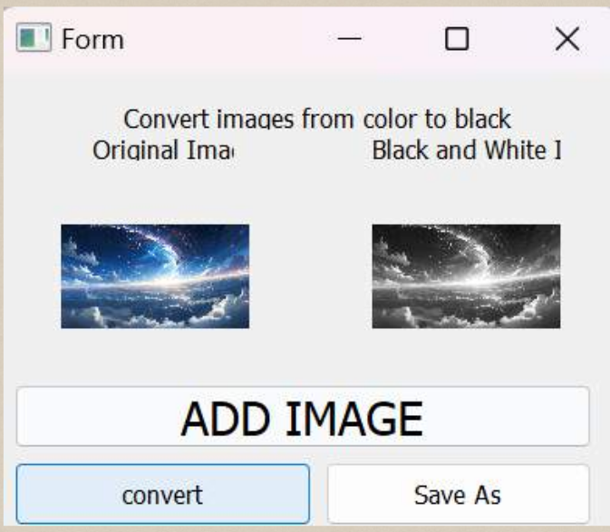

# Color image to black and white image converter

Writter: Lintang Yoga Wistara

Date: December 18, 2024  

This application is a Color image to black and white image application. This simple application aims to ensure that everyone understands and understands how to install and use this application.

## How to installation with Visual Studio Code in WINDOWS and UBUNTU

- Download and install VS Code.

  - open VS Code

  - install ekstensi Git in VS Code

  - Clone this repository in search bar in VS Code 

  ``` https://github.com/linseayw/testLTI.git```

- Create virtual environment in terminal
  - Terminal in UBUNTU

  ``` $ virtualenv venv```

  - Terminal in WINDOWS  
  ``` python -m venv nama_env```
  
- Change directory virtual environment
  
  - Telminal in UBUNTU
  ``` $ source venv/bin/activate```

  - Teminal in WINDOWS
  ```cd C:\path\to\directory\my_env```
  
- Installation library

- Running program

  - Telminal in UBUNTU
  ``` $ python3 ubahgambarr.py```

  - Telminal in WINDOWS
  ``` python ubahgambarr.py```

   ## Show to user interface

   